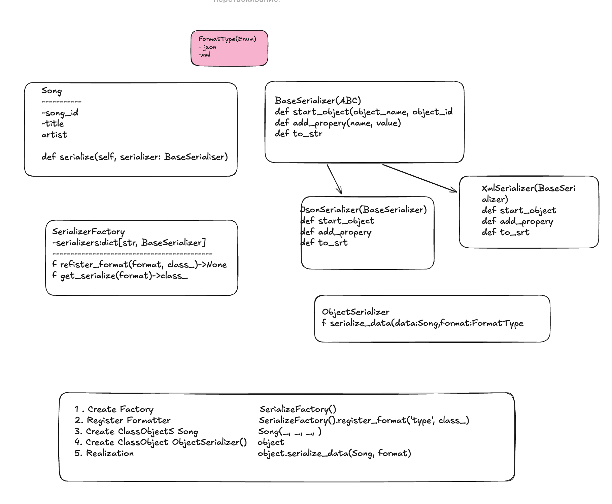

``` python
import json
import xml.etree.ElementTree as et
from enum import Enum
from typing import Type
from abc import ABC, abstractmethod


class FormatType(str, Enum):
    """list access format serialize"""

    json = "json"
    xml = "xml"


class Song:

    def __init__(self, song_id: str, title: str, artist: str) -> None:
        self.song_id = song_id
        self.title = title
        self.artist = artist

    def serialize(self, serializer: "BaseSerializer") -> None:
        serializer.start_object("song", self.song_id)
        serializer.add_property("title", self.title)
        serializer.add_property("artist", self.artist)


class BaseSerializer(ABC):

    @abstractmethod
    def start_object(self, object_name: str, object_id: str) -> None:
        pass

    @abstractmethod
    def add_property(self, name: str, value: str) -> None:
        pass

    @abstractmethod
    def to_str(self) -> str:
        pass


class JsonSerializer(BaseSerializer):
    """serializer to json format"""

    def __init__(self) -> None:
        self._current_object: dict[str, str] = {}

    def start_object(self, object_name: str, object_id: str) -> None:
        self._current_object = {"id": object_id}

    def add_property(self, name: str, value: str) -> None:
        self._current_object[name] = value

    def to_str(self):
        return json.dumps(self._current_object)


class XmlSerializer(BaseSerializer):
    """serializer to mxl format"""

    def __init__(self) -> None:
        self._element: et.Element | None = None

    def start_object(self, object_name: str, object_id: str) -> None:
        self._element = et.Element(object_name, attrib={"id": object_id})

    def add_property(self, name: str, value: str) -> None:
        if self._element is not None:
            prop = et.SubElement(self._element, name)
            prop.text = value

    def to_str(self) -> str:
        return et.tostring(self._element, encoding="unicode") if self._element else ""


class SerializerFactory:

    def __init__(self) -> None:
        self._serializers: dict[str, type[BaseSerializer]] = {}

    def register_format(
        self, format_type: str, 
        serializer_class: Type[BaseSerializer]
    ) -> None:
        """register serializer by input format"""

        if not callable(serializer_class):
            raise ValueError(f"creator: {serializer_class} must be  callable")
        self._serializers[format_type] = serializer_class

    def get_serializer(self, format_type: str) -> BaseSerializer:
        """returned serializer by format"""
        serializer_class = self._serializers.get(format_type)
        if not serializer_class:
            raise ValueError(f"Uncnow format: {format}")
        return serializer_class()


class ObjectSerializer:

    def serialize_data(self, data: Song, format_type: FormatType) -> str:
        # get format for serialization
        serializer = factory.get_serializer(format_type)
        data.serialize(serializer)
        return serializer.to_str()


if __name__ == "__main__":
    # create factory serializators
    factory = SerializerFactory()

    #register formatter
    factory.register_format(FormatType.json, JsonSerializer)
    factory.register_format(FormatType.xml, XmlSerializer)

    song = Song("1", "Water of Love", "Dire Straits")
    serializer = ObjectSerializer()

    # serialization process, JSON
    json_result = serializer.serialize_data(song, FormatType.json)
    print("JSON:", json_result)

    # serialization process, XML
    xml_result = serializer.serialize_data(song, FormatType.json)
    print("\nXML:", xml_result)

```
